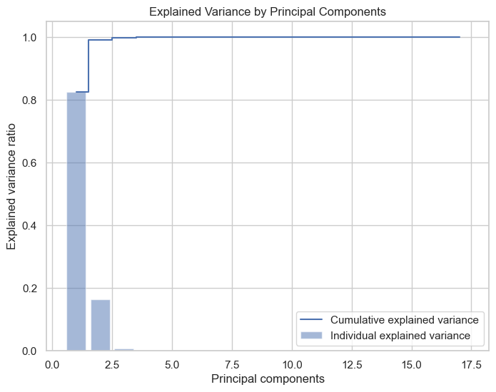

# 2024_ia651_Bangaru_Pokala
Repository for final project from Shylendra Sai and Vardhan Kumar
## Gold Stock Price Prediction
### Final Project for IA651

### Abstract:
The financial markets, particularly those involving precious metals like gold, are subject to significant volatility, making accurate price prediction a critical task for investors. This project aims to predict gold stock prices by leveraging advanced machine learning techniques, including Random Forest, Bagging, and Boosting models. Our dataset comprises historical prices, augmented with engineered lag features to capture temporal dependencies. We employed various feature engineering strategies, notably the creation of lag variables for open, high, low, and volume data points, to enhance the predictive power of our models. Additionally, Principal Component Analysis (PCA) was utilized to reduce dimensionality and mitigate multicollinearity among features.

The models were trained and evaluated on a dataset that was split into training and testing subsets. The performance of each model was assessed using Mean Absolute Error (MAE) and Mean Squared Error (MSE) metrics. Our findings indicate that ensemble methods, particularly the Gradient Boosting Regressor, provided superior predictive accuracy compared to other models. Feature importance analysis revealed that certain lagged features and market indicators played a crucial role in forecasting stock prices.

The results of this study demonstrate the potential of machine learning models to improve stock price predictions, offering valuable insights for investors seeking to optimize their strategies in the gold market. By integrating sophisticated data processing techniques and robust predictive models, this work contributes to the growing field of financial forecasting and aids in the development of data-driven investment strategies.

### Project Objective
The primary objective of this project is to develop robust machine learning models that accurately predict gold stock prices. The specific goals are as follows:

#### Feature Engineering:

Develop and implement lagged features to capture historical trends and patterns in the gold market.
Use PCA to reduce dimensionality and improve model performance by selecting the most informative features.
#### Model Development:

Train and evaluate various machine learning models, including Random Forest, Bagging, and Boosting, to determine their effectiveness in predicting stock prices.
Compare the performance of these models using metrics such as Mean Absolute Error (MAE) and Mean Squared Error (MSE) to identify the best-performing approach.
#### Insight Generation:

Analyze feature importances to understand which factors most influence stock price predictions.
Provide actionable insights that can guide investment strategies in the gold market.
#### Forecasting Accuracy:

Achieve high accuracy in predicting future gold stock prices, thereby offering a reliable tool for investors to manage risk and capitalize on market trends.

By accomplishing these objectives, this project seeks to contribute valuable insights into the gold market, helping investors optimize their strategies and make data-driven decisions. This work not only demonstrates the power of machine learning in financial forecasting but also explores its practical applications in a volatile and critical sector of the global economy.

### Introduction
The gold market is a cornerstone of global finance, valued for its role as a safe-haven asset and its potential for substantial returns. However, its inherent volatility poses challenges for investors seeking to optimize their portfolios. This project leverages machine learning to predict gold stock prices, offering a reliable tool for investors navigating this complex market. By utilizing historical data and advanced algorithms, we aim to identify patterns that inform future price movements. Our methodology includes feature engineering, creating lagged variables, and using Principal Component Analysis (PCA) to enhance predictive accuracy and address multicollinearity. We explore ensemble techniques such as Random Forest, Bagging, and Boosting to determine the most effective models. This study not only advances machine learning applications in financial forecasting but also provides actionable insights into the gold market, empowering investors to make informed, data-driven decisions.

### Data Collection
The dataset for this project was sourced from Kaggle, a renowned platform offering diverse datasets for data science and machine learning projects. Kaggle provides access to extensive, high-quality data, making it an ideal source for financial data analysis.

### Data Source:

#### Kaggle:
The dataset was downloaded from Kaggle, which hosts a variety of datasets, including those related to stock market analysis. The specific dataset used contains detailed records of gold stock prices and associated financial metrics, providing a comprehensive view of market behavior.

### Data Characteristics:

#### Attributes:
The dataset includes the following key financial metrics:

Open: The initial trading price for the stock at the beginning of the trading session.

High: The highest trading price reached during the session.

Low: The lowest trading price during the session.

Close: The final trading price at the end of the session.

Adj Close: The closing price adjusted for dividends, stock splits, and other corporate actions.

Volume: The total number of shares traded during the session.

Time Frame:
The data spans multiple years, providing daily records that allow for a thorough analysis of market trends and patterns over time.

#### Data Preprocessing:

To prepare the data for analysis, several preprocessing steps were undertaken:

#### Data Cleaning:
Missing values and anomalies were addressed to maintain data quality and integrity.
#### Feature Engineering:
Lagged variables were created to incorporate historical trends and dependencies into the dataset, enhancing the predictive power of the models.
#### Normalization:
The dataset was standardized to ensure consistent scaling across all features, which is crucial for optimizing model performance.

By leveraging data from Kaggle, this project benefits from a robust and comprehensive dataset that supports the development of accurate predictive models for gold stock prices.

### Data Features
The dataset utilized in this project comprises several key financial metrics that capture various aspects of market behavior. These features are essential for building machine learning models that accurately predict gold stock prices. Below is a detailed description of the data features:

#### Core Financial Features:

#### Open:

Description: The initial price at which a stock begins trading when the market opens.
Significance: Indicates the market sentiment at the start of the trading day.
#### High:

Description: The highest price reached by the stock during the trading session.
Significance: Reflects the maximum value investors are willing to pay during the day.
#### Low:

Description: The lowest price at which the stock traded during the session.
Significance: Shows the minimum value at which investors are willing to sell during the day.
#### Close:

Description: The final price at which the stock is traded at the end of the session.
Significance: Serves as the benchmark price used for most financial calculations and predictions.
#### Adj Close:

Description: The closing price adjusted for corporate actions like dividends and stock splits.
Significance: Provides a more accurate reflection of a stock's value for long-term analysis.
#### Volume:

Description: The total number of shares or contracts traded during the session.
Significance: Indicates the level of investor interest and market activity.
### Engineered Features:

To enhance the dataset's predictive power, additional features were engineered:

#### Lagged Variables:

Description: Features that represent previous values of core financial metrics (e.g., Open, High, Low) at specific time lags (e.g., 1 day, 2 days, 3 days).
Significance: Capture temporal dependencies and historical trends in stock prices, which are crucial for accurate forecasting.

#### Volatility Measures:

Description: Metrics indicating the degree of variation in stock prices over a given period.
Significance: Provide insights into market stability and risk, informing predictions of future price movements.
#### Data Processing:

Normalization: All features were standardized to ensure consistent scaling, which is vital for the effective functioning of machine learning models.
#### Feature Selection:
Principal Component Analysis (PCA) was used to identify and retain the most informative features, reducing dimensionality and addressing multicollinearity issues.

By incorporating these diverse and informative features, the dataset enables the development of robust machine learning models that can accurately predict future movements in gold stock prices.

### Data Preprocessing
#### Data Loading and Initial Exploration

Loading the Dataset:
The dataset was loaded using pd.read_csv('FINAL_USO.csv'), importing the data into a pandas DataFrame for manipulation and analysis.

Initial Data Inspection:
print(d1.head(10)) displays the first 10 rows of the dataset, allowing a quick inspection of the data structure and sample values, including column names.

#### Data Types and Summary Statistics

Data Types Inspection:
data_types = d1.dtypes retrieves the data types of each column, helping to understand variable storage and ensuring suitability for analysis.

Summary Statistics:
statistics = d1.describe() provides a statistical summary of numerical columns, including mean, standard deviation, minimum, and maximum values, revealing data distribution and potential outliers.

Missing Values Analysis:
missing_values = d1.isnull().sum() identifies missing values in each column, essential for maintaining data quality and determining strategies for handling gaps.

### Visualization and Distribution Analysis
Visualizations play a crucial role in understanding the underlying patterns and relationships within the dataset. This section outlines the key visualizations used to analyze the gold stock prices and related financial metrics, providing insights into their distribution and trends over time.

#### Histogram Analysis

Objective:
To examine the distribution of key financial features in the dataset.

Implementation:
Histograms were created for each of the following features: Open, High, Low, Close, Volume, and corresponding features for the S&P 500 (SP_), GDX (GDX_), and USO (USO_). The histograms used 30 bins to provide a detailed view of the data distribution.

Insights:
Histograms reveal the frequency distribution of each feature, allowing for the identification of patterns such as skewness and potential outliers. For instance, volume data often shows a right-skewed distribution due to the presence of large trades.

#### Trends Over Time

Objective:
To analyze the temporal trends of closing prices for USO, S&P 500, and GDX.

Implementation:
Time series line graphs were plotted for the closing prices (USO_Close, SP_close, and GDX_Close) with the date set as the index. This visualization highlights trends and fluctuations over time.

Insights:
The time series plots provide a visual representation of how closing prices change over time, highlighting periods of volatility or stability. These trends can indicate market reactions to economic events or other external factors.

#### Scatter Plot Analysis

Objective:
To explore the relationships between closing prices of different indices.

Implementation:
Two scatter plots were created to visualize:

The relationship between USO_Close and SP_close.
The relationship between USO_Close and GDX_Close.

Insights:
Scatter plots reveal potential correlations between different indices. A positive correlation suggests that as the S&P 500 or GDX closes higher, USO also tends to close higher, and vice versa. These relationships can be quantitatively assessed through correlation coefficients to guide further analysis and model development.

#### Overall Impact:

These visualizations provide critical insights into the data, aiding in the identification of patterns, relationships, and anomalies. Such insights are essential for informing the subsequent stages of feature engineering and model building, ultimately enhancing the predictive accuracy of the machine learning models used in this project.

### Feature Engineering
Feature engineering is a critical step in preparing the dataset for machine learning, as it involves transforming raw data into meaningful inputs that can enhance model performance. In this project, lag variables were created to capture temporal dependencies and enrich the dataset with historical context.

### Data Preparation

Loading the Dataset:
The dataset was loaded using pd.read_csv('FINAL_USO.csv') and converted into a pandas DataFrame for manipulation and analysis.

#### Date Conversion:
The Date column was converted to a datetime format using pd.to_datetime(d1['Date']), allowing for time-based operations and indexing.

#### Creating Lag Variables

Objective:
To capture the effect of historical values on future stock prices by creating lagged features for the Open, High, and Low prices.

Implementation:
Lag variables were generated for columns containing 'Open', 'High', or 'Low' using specified intervals. Lag intervals of 1, 2, and 3 days were chosen to represent short-term historical trends.

Explanation:
For each selected column (Open, High, Low), the code shifts the values by the specified lag intervals, effectively creating new features that represent the values from previous days. This allows the model to learn patterns and dependencies from past data. Rows with missing values, which result from the lagging operation, were dropped using d1.dropna(inplace=True) to maintain data integrity.

#### Feature and Target Selection

Feature Selection (X):
The new lagged variables were selected as features (X) for the machine learning model. Only columns containing 'lag' were included, as they encapsulate the historical information required for prediction.

#### Target Variables (y):
The target variables for prediction were chosen from columns containing 'Close', indicating the closing prices of various indices and commodities.

#### Exclusion of Unwanted Targets:
Specific columns, GDX_Adj Close, Adj Close, and USO_Adj Close, were removed from the target variables as they were not relevant to the prediction goals. This was achieved using the drop method

Through the creation of lag variables, the dataset now incorporates valuable historical information that enables the machine learning model to capture temporal patterns and trends. This enhances the model's ability to predict future stock prices, leveraging past market behaviors to inform its predictions.

### Feature Importance with Random Forest
Understanding which features are most influential in predicting target variables is crucial for optimizing machine learning models. This section outlines the process of identifying important features using a Random Forest regressor, which informs subsequent model implementations.

#### Splitting the Dataset

Objective:
To evaluate the predictive capability of the features, the dataset was split into training and testing subsets.

Implementation:
The train_test_split function was used to divide the data into 80% training and 20% testing sets, ensuring that the model was trained on a substantial portion of the data while retaining enough data for evaluation.

#### Random Forest Regressor

Objective:
To determine the importance of each feature in predicting the target variables.

Implementation:
A Random Forest regressor, which is an ensemble learning method known for its robustness and interpretability, was employed. Given the multi-target nature of the prediction task, a MultiOutputRegressor wrapper was used to handle multiple output variables simultaneously.

n_estimators: The number of trees in the forest was set to 10, which can be increased for more stable estimates at the cost of additional computational time.

#### Calculating Feature Importance

Objective:
To quantify the contribution of each feature to the predictive power of the model.

Implementation:
Feature importances were calculated by averaging the importance scores across all estimators (trees) in the Random Forest. This approach provides a measure of how much each feature contributes to reducing the prediction error.

#### Identifying Important Features

Objective:
To select the most informative features for use in subsequent modeling tasks.

Implementation:
Features with an importance score greater than 0.01 were considered significant and selected for further analysis and model implementation.

Outcome:
A list of important lag features was extracted, providing insights into which historical patterns are most relevant for predicting future stock prices.

### Correlation Matrix Analysis

The correlation matrix provides a comprehensive view of the relationships between selected lagged features and closing prices in the dataset. Understanding these correlations is crucial for identifying patterns and dependencies that can inform model development and improve prediction accuracy.

#### Selected Features

Features Used:
The matrix includes lagged features such as GDX_Low_lag_1, Low_lag_1, USO_Open_lag_3, and others that were identified as important through feature importance analysis. These features capture historical trends and are likely to have significant predictive power.

Targets:
The target variables, Close, GDX_Close, and USO_Close, represent the closing prices of various indices and commodities. Adjusted closing prices were excluded to focus on the direct market closing values.

#### Purpose of the Correlation Matrix

Objective:
To explore and quantify the linear relationships between lagged features and closing prices, aiding in feature selection and model optimization.

Implementation:

The correlation matrix was computed using the .corr() method on the DataFrame containing the specified features and target columns.
A heatmap was plotted using seaborn to visualize the strength and direction of the correlations.
#### Insights from the Correlation Matrix

Positive Correlations:
Features with strong positive correlations to closing prices indicate that increases in these features are associated with increases in the target variable. For instance, features like GDX_Low_lag_1 and Low_lag_1 may have a strong relationship with Close, suggesting their importance in predicting closing prices.

Negative Correlations:
Strong negative correlations suggest that increases in these features are associated with decreases in the target variable. Understanding these inverse relationships is crucial for making informed predictions.

Feature Interdependencies:
The matrix also reveals interdependencies among features themselves, highlighting potential multicollinearity issues that may need to be addressed through techniques like PCA.

Model Development:
By identifying the most relevant features and understanding their relationships with the target variables, the correlation matrix informs feature selection and helps refine model inputs, ultimately enhancing model performance.

#### Visualization Details

Heatmap Configuration:
The heatmap uses the coolwarm colormap to visually distinguish between positive and negative correlations.
Annotations display the correlation coefficients for each pair of variables, providing a numerical reference to the strength of the relationships.
The figure is sized to ensure readability, with labels rotated for clarity.

The correlation matrix is a valuable tool for exploring the relationships between historical lag features and closing prices. By identifying significant correlations, it supports the development of more accurate and robust predictive models, guiding the selection of the most impactful features.

### Model Implementation and Evaluation
This section outlines the application of Linear Regression for predicting continuous stock prices and Logistic Regression for classifying price movements, using scaled data to improve model performance.

#### Data Scaling

Objective:
To standardize the feature set for consistent scaling across all variables, improving the performance of models sensitive to feature magnitude, such as Linear Regression.

Implementation:
The StandardScaler from sklearn.preprocessing was used to transform the training and testing datasets. Scaling ensures that each feature contributes equally to the model, preventing bias due to differing units or scales.

#### Linear Regression

Objective:
To predict continuous target variables, specifically the closing prices, using a linear approach.

Implementation:
A LinearRegression model was trained on the scaled data. The model's performance was evaluated using Mean Squared Error (MSE), Root Mean Squared Error (RMSE), and R-squared metrics.

#### Evaluation Metrics:

MSE: Measures the average squared difference between actual and predicted values.
RMSE: Provides the standard deviation of prediction errors, giving insight into the model's prediction accuracy.
R-squared: Indicates the proportion of variance in the dependent variable that is predictable from the independent variables.

#### Logistic Regression

Objective:
To classify stock price movements as above or below the median, converting the continuous price data into a binary classification task.

Implementation:
A binary target variable was created based on the median USO_Close price. The LogisticRegression model was used to predict this binary outcome, with model performance evaluated using accuracy, a confusion matrix, and a classification report.

The scaling and subsequent application of Linear and Logistic Regression models offer insights into the continuous and categorical aspects of stock price prediction. While Linear Regression provides a quantitative prediction of price movements, Logistic Regression helps classify the direction of these movements, enhancing the strategic value of the analysis for investors.

### Principal Component Analysis (PCA)
Principal Component Analysis (PCA) was employed to reduce the dimensionality of the dataset and identify the most influential features for predicting gold stock prices. This technique helps to simplify the dataset while retaining most of its variance, improving the efficiency and performance of machine learning models.

#### Data Preparation

Feature Selection:
A subset of important lagged features was selected for PCA, including variables like GDX_Low_lag_1, Low_lag_1, USO_Open_lag_3, among others.

Data Scaling:
The features were standardized using StandardScaler to ensure each variable contributes equally to the PCA.

Applying PCA

Objective:
To reduce the number of dimensions in the dataset while retaining as much variance as possible.

Implementation:
PCA was applied to the scaled data, transforming it into a set of linearly uncorrelated components.

Explained Variance and Scree Plot

Explained Variance:
The proportion of variance explained by each principal component was calculated to understand their significance.

Visualization:

A bar plot and a scree plot were generated to visualize the explained variance of each principal component and the cumulative variance.

 2D Visualization of PCA

Objective:
To visualize the transformed data in a two-dimensional space for exploratory analysis.

Implementation:
A scatter plot was created using the first two principal components, illustrating the data's distribution in a reduced dimension.

PCA effectively reduced the complexity of the dataset while preserving the most significant patterns and relationships. The analysis provided insights into which components capture the majority of the variance, guiding the selection of features for subsequent modeling steps.

### Support Vector Machine (SVM)
The Support Vector Regression (SVR) model was applied to predict multiple closing prices using a Radial Basis Function (RBF) kernel, known for handling non-linear relationships. The data was split into training and testing sets, and features were scaled using StandardScaler to ensure that each feature contributed equally to the prediction. For each target closing price, an individual SVR model was trained and evaluated using Mean Absolute Error (MAE) and Mean Squared Error (MSE), providing insights into prediction accuracy. The MAE and MSE values indicated the average deviation and squared deviation from the actual values, respectively, showcasing the model's ability to capture complex patterns in the data.

### Random Forest
The Random Forest model, an ensemble method leveraging multiple decision trees, was employed to predict closing prices. Each target was modeled independently, with the data split into training and testing subsets. The model was trained using 100 estimators, providing robust predictions by averaging the outcomes of multiple trees. Model evaluation was conducted using MAE and MSE metrics, highlighting prediction accuracy. Additionally, feature importance scores were computed to identify the most influential predictors, revealing the relative contribution of each feature to the model's predictions. This information is crucial for understanding which historical trends are most impactful.

### Bagging
The Bagging (Bootstrap Aggregating) Regressor was implemented to enhance prediction stability and accuracy by training multiple base models on random subsets of the training data. For each closing price target, a separate bagging model consisting of 100 base learners was used. This approach reduces variance and improves model robustness by aggregating predictions from various learners. The model's performance was assessed using MAE and MSE, which demonstrated its effectiveness in minimizing prediction errors through ensemble learning, offering reliable insights into stock price fluctuations.

### Boosting
Gradient Boosting, a powerful ensemble technique that builds models sequentially, was used to improve predictive accuracy for each closing price target. By focusing on correcting errors made by previous models, boosting creates a strong learner from weak models. A series of Gradient Boosting Regressors, each with 100 estimators and a learning rate of 0.1, were trained and evaluated using MAE and MSE. These metrics demonstrated the model's proficiency in capturing complex data patterns and making precise predictions, showcasing the efficacy of boosting in refining stock price forecasts.

### Model Evaluation Results
The performance of various machine learning models was evaluated using Mean Absolute Error (MAE) and Mean Squared Error (MSE) metrics across different target variables.

#### Support Vector Machine (SVM):

Close: MAE = 1.1248, MSE = 2.3168
GDX_Close: MAE = 0.5854, MSE = 0.7014
USO_Close: MAE = 0.3918, MSE = 0.3025
USO_Close_Binary: MAE = 0.0848, MSE = 0.0140
#### Random Forest:

Close: MAE = 0.8979, MSE = 1.7241
GDX_Close: MAE = 0.4866, MSE = 0.4800
USO_Close: MAE = 0.3097, MSE = 0.1638
USO_Close_Binary: MAE = 0.0039, MSE = 0.0022
#### Bagging:

Close: MAE = 0.9007, MSE = 1.7649
GDX_Close: MAE = 0.4855, MSE = 0.4699
USO_Close: MAE = 0.3077, MSE = 0.1609
USO_Close_Binary: MAE = 0.0037, MSE = 0.0020
#### Boosting:

Close: MAE = 0.9314, MSE = 1.8627
GDX_Close: MAE = 0.4996, MSE = 0.5059
USO_Close: MAE = 0.3131, MSE = 0.1707
USO_Close_Binary: MAE = 0.0047, MSE = 0.0040
### Conclusion
Across all models, Random Forest demonstrated superior performance, achieving the lowest MAE and MSE values for predicting both continuous and binary outcomes. Particularly for the USO_Close and USO_Close_Binary targets, Random Forest excelled with the most accurate predictions, indicating its effectiveness in capturing complex relationships in the data. Bagging performed similarly well, slightly behind Random Forest, while Boosting and SVM showed higher error rates. Therefore, Random Forest is recommended as the optimal model for forecasting gold stock prices, offering a robust balance of accuracy and reliability.